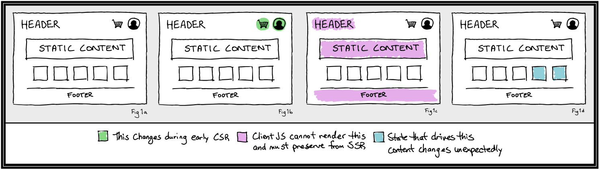

# SSR Rehydration

## Summary

Whereas server-side rendering (SSR) allows a web application to be rendered into HTML on the server, rehydration involves receiving that HTML on the client and reusing the resulting DOM during client-side rendering (CSR).

This document proposes an approach to provide SSR rehydration in LWC.

## Problem description

### Motivation

The motivations for SSR are [well documented](https://medium.com/walmartglobaltech/the-benefits-of-server-side-rendering-over-client-side-rendering-5d07ff2cefe8) and can be boiled down to the following two points:

- SSR allows search engines to easily index URLs that would otherwise be rendered on the client as part of a web application. This results in improved [SEO](https://developers.google.com/search/docs/beginner/seo-starter-guide), with all the associated benefits.

- SSR can improve the perceived startup performance of a web application by reducing the time to [First Contentful Paint](https://web.dev/first-contentful-paint/). Optimizing perceived performance can have measurable impact on [conversion rates](https://www.cloudflare.com/learning/performance/more/website-performance-conversion-rates/), [user satisfaction](https://www.ericsson.com/en/press-releases/2016/2/streaming-delays-mentally-taxing-for-smartphone-users-ericsson-mobility-report), and [revenue](https://www.dareboost.com/en/webperf-impacts).

However, rendering on the server can itself introduce performance issues, working against the original intent. Namely, if DOM that was generated from SSR HTML is not preserved during the initial CSR, this will result in potentially expensive DOM manipulation.

The aim of rehydration is to avoid the client-side performance issues of a naive SSR implementation, reusing original DOM wherever possible.

### The Happy Path

With regard to SSR, there exists a happy path (Fig 1a) where the rendering output for a given request is identical on both the server and the client; identical VDOM is generated for the entire document in both environments.

Depending upon the actual implementation, exceptions to this happy path are as follows:

- **Exception A:** One or more components are never rendered on the server (Fig 1b). Instead, a placeholder is rendered on the server, and later replaced on the client during CSR/hydration.
  - **Example:** The page contains a cart icon with a dynamic number of items in cart.
  - **Example:** The page contains a user avatar.
- **Exception B:** One or more components are rendered only on the server (Fig 1c). No JS is sent to the client for these components and the original SSR'd HTML remains untouched by hydration and later client-side renders.
  - **Example:** The page contains a footer that never changes.
  - **Example:** The landing page is mostly static and is cached on a CDN.
- **Exception C:** Render-critical state is changed between the time of SSR and CSR/hydration, causing an unexpected mismatch (Fig 1d).
  - **Example:** A product price is updated after SSR but before hydration on the client.
  - **Example:** The CDN delivers a stale version of the landing page, which was updated while the SSR HTML was en route to the client.

<figure>
    
  <figcaption align = "center">
    <b>Fig.1: the happy path and its exceptions</b>
  </figcaption>
</figure>

## Design

Several pieces need to come together to unlock rehydration. The general flow is illustrated below in figure 2.

<figure>
    
  <figcaption align = "center">
    <b>Fig.2: the proposed implementation</b>
  </figcaption>
</figure>

In roughly chronological order with respect to a single page request, the following steps shall be taken as part of rehydration:

- As part of SSR, serialize render-critical state and bake it into the HTML response returned from the server.
  
  - For each `LightningElement`, attach corresponding state to its root DOM node as `data-ssr-state`.
  
  - For `LightningServerElement`s, mark them with `data-ssr-preserve`.
  
  - For `LightningClientElement`s, render the provided placeholder component.
  
  - Where necessary (detailed below), mark the HTML of server-only or client-only components with associated `data-*` attributes (detailed below).

- Rather than calling `LWC#createElement`, call `LWC#hydrateElement` to mount the root Lightning Web Component on the client.

- Generate server-side VDOM (ssVDOM) from the SSR HTML on the client.

- As the initial client-side render progresses, extract state from `data-ssr-state` attributes, instantiate `LightningElements` with extracted state, and generate client-side VDOM (csVDOM).

- Patch ssVDOM with csVDOM.
  
  - Where `data-ssr-preserve` is detected, extract the ssVDOM subtree and store for subsequent client-side renders.
  
  - Attach event listeners and non-serializable props.
  
  - Resolve unexpected inconsistencies in favor of the csVDOM, addressing [Exception C to the happy path](#the-happy-path).

### `hydrateElement`

In a typical LWC web application, a developer might mount their app using the following pattern:

```javascript
import { createElement } from 'lwc';
import MyApp from './my-app';

document
  .querySelector("#root")
  .appendChild(createElement('my-app', { is: MyApp }));
```

After the proposed change, if a developer wants to take advantage of rehydration, a developer would instead do:

```javascript
import { hydrateElement } from '@lwc/ssr';
import MyApp from './my-app';

hydrateElement(MyApp, document.querySelector('#root')); 
```

### `LightningServerElement`

`LightningServerElement` is a new class exported from the `lwc` package. Its behavior and underlying implementation bifurcates depending on the runtime environment.

On the server, a `LightningServerElement` behaves identically to a `LightningElement` with one exception: a `data-ssr-preserve` attribute is attached to the root node.

On the client, a `LightningServerElement` is swapped out for an LWC-internal component. This component's sole purpose is to store VDOM originating from SSR and returning that VDOM on each subsequent client-side render.

The client-side behavior is accomplished though a Babel plugin in the LWC compiler that runs for client-side builds only. This plugin identifies class declarations and expressions that extend `LightningServerElement` and replaces the entire declaration/expression with a component that'll store and later regurgitate the ssVDOM subtree.

Any dependencies that are specific to the server implementation can be dropped from the client via dead-code elimination, ensuring that server-only components are rendered once on the server and no associated JS is sent to the client.

`LightningServerElement` addresses [Exception B to the happy path](#the-happy-path).

### `LightningClientElement`

**TODO:** Determine if there is a better name for this.

`LightningClientElement` is another new class exported from the `lwc` package.

When defining a `LightningClientElement`, a public static field will be provided indicating a `LightningElement` to be rendered on the server. During SSR, this element will be rendered in place of the `LightningClientElement`.

On the client, a `LightingClientElement` will be have identically to a `LightningElement`. During compilation for the client, public static fields will be stripped from `LightningClientElement`s via a Babel plugin.

`LightningClientElement` addresses [Exception A to the happy path](#the-happy-path).

### Server and Client Builds

Both `LightingServerComponent` and `LightningClientComponent` depend upon target-specific code transforms that are applied during the build.

The `@lwc/rollup-plugin` will need to be extended to accept a `target` configuration option, where valid options are `client` (default) or `server`. Additionally, documentation and examples will need to be provided to show how to generate and consume the server and client builds.

## Drawbacks

- **Complexity:**
  
  - The proposed changes result in a less straightforward LWC with an expanded API surface area.
  
  - We should aim to reduce complexity as much as possible without compromising core functionality.

- **Maintenance burden:**
  
  - Changes will be required in multiple LWC subpackages and some of these changes may be interdependent.
  
  - We should aim to avoid implicit dependencies wherever possible.

- **Web app complexity:**
  
  - An LWC web application that pulls in SSR rehydration will be more difficult to comprehend than without.
  
  - There will be multiple compiler outputs. How to consume these outputs may be nonobvious and doing so may require more glue code.
  
  - Much of this complexity is intrinsic to SSR and therefore unavoidable. _However_, this means that documentation and cookbook-style examples are of vital importance.

## Alternatives

### LightningServerComponent & LightningClientComponent

At first blush, `LightningServerComponent` and `LightningClientComponent` seem similar in that their behavior can diverge depending on the runtime environment.

Rather than exporting both of these, we could export a single class that allows a developer to explicitly define a server and client implementation as public static fields. In addition, a helper component could be exported that captures SSR VDOM and preserves it for subsequent client-side renders.

While this approach is attractive in its adherence to the [DRY principle](https://en.wikipedia.org/wiki/Don%27t_repeat_yourself), a "server component" model is used in other web frameworks, which impacts its familiarity.  Additionally, requiring the use of a helper module for ssVDOM preservation may be unintuitive.

### Resilience to unexpected changes

As detailed below in the [Survey of Prior Art](#survey-of-prior-art), some web frameworks choose _not_ to be resilient to unexpected changes in state and resulting HTML/VDOM. A great example of this is React. However, React considers complex state management out of scope.

For performance reasons, Vue will also not repair mismatching HTML during rehydration. However, this is less of an issue in practice, because Vue will take a snapshot of state and ship it alongside the rendered application as `window.__INITIAL_STATE__`.

Most framework authors have indicated that non-support for rehydration resilience is due to performance reasons. We should measure the performance impact of SSR rehydration in a large LWC app to either 1) validate our design decision, or 2) point us in a new direction.

# How we teach this

Much like the new functionality itself, the documentation for this functionality is mostly an add-on. We won't be changing how anything works and we won't need to explain existing functionality any differently.

Beneficial documentation may include:

- an introductory blog post, explaining the underlying implementation

- a new section in the [LWC Guide](https://lwc.dev/guide/introduction), explaining the SSR-specific APIs and demonstrating how to get SSR up and running

- an addition to the [LWC Recipes](https://recipes.lwc.dev/) or an example application utilizing SSR

# Survey of Prior Art

A handful of influential web frameworks and state management libraries were examined in relation to rehydration and adjacent concerns. The findings are summarized as follows:


1) React 17 will feature enable Suspense on the server. Functionality is currently available through a third-party library.
2) Svelte stores information for associating DOM nodes with components in the `<head>`.
3) Vue will await async data fetch at the component level, using `serverPrefetch`.
4) Vue annotates root SSR nodes with HTML attrs denoting them as server rendered.
5) Prior to React 16, rehydration could handle any mismatch between SSR and CSR VDOM. After React 16, only text nodes can mismatch.
6) In development mode, Vue checks server-rendered DOM against client-rendered DOM. In production, this is disabled for performance reasons.
7) It is technically possible but difficult to utilize nested stores alongside SSR, and not provided out-of-the-box.

# Unresolved questions

TODO